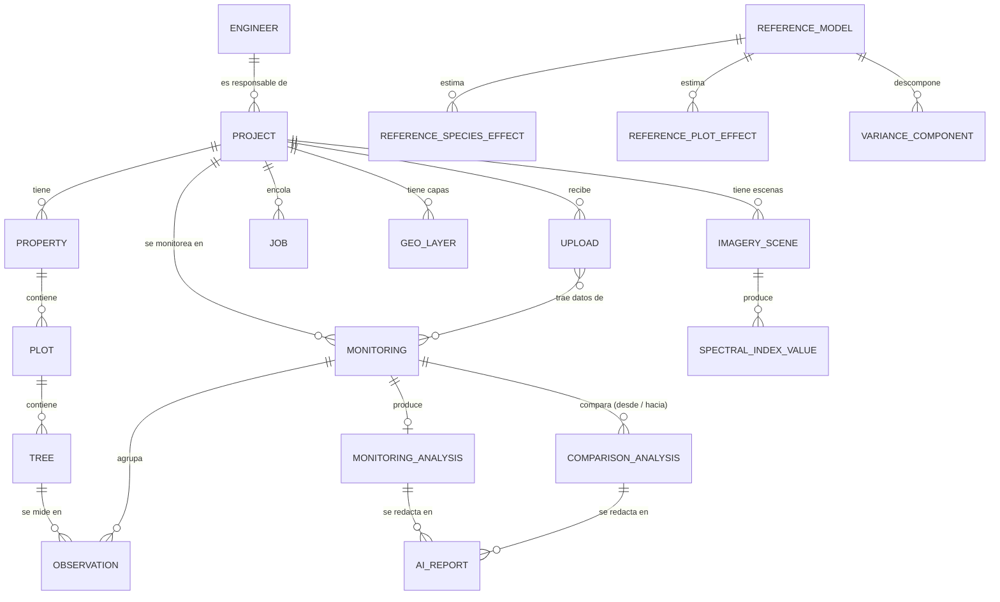
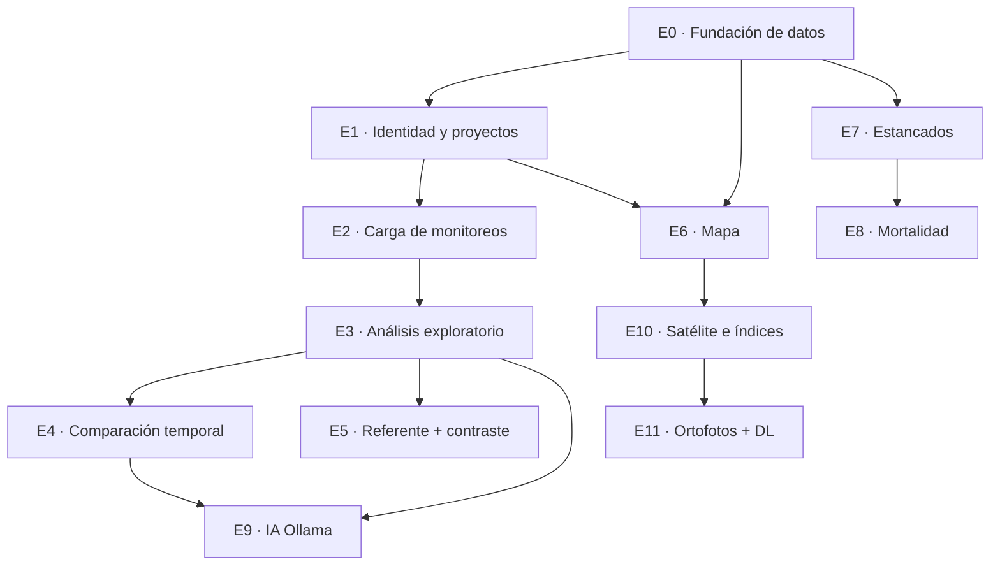

# 04 — Visión de producto: arquitectura y roadmap

Fecha: 2026-09-21 (avance al 2026-09-22). Estado: **aprobado (decisiones en §12)**.
Avance: **E0 ✅** (`docs/verificacion-e0.md`) · **E1 ✅** (`docs/verificacion-e1.md`;
falta el login con una cuenta real) · **E2+E3 ✅** (`docs/verificacion-e2e3.md`;
falta el recorrido en navegador) · **E6 · mapa del predio ✅**
(`docs/verificacion-e6.md`) · siguiente: **ortofoto opcional por proyecto**.

Reabre dominio y arquitectura (AGENTS.md: «un slice puede reabrir dominio o
arquitectura cuando revela un requisito no contemplado, con justificación, ADR
y revisión de impacto»). El requisito no contemplado es que AgroSense sea una
plataforma de trabajo para el ingeniero, no un dashboard de resultados
precalculados.

---

## 0. Por qué este documento existe

Lo construido hasta el Slice 5 tiene una ruta rota: el ingeniero no puede
llegar desde su Excel a su análisis. La ingesta existe (Slice 2), pero ninguna
pantalla la usa; la analítica existe (Slice 5), pero sale de un script que se
corre a mano y **no se recalcula cuando llegan datos nuevos**.

El flujo objetivo:

```
Ingeniero → Proyecto → Monitoreos → Datos → Procesamiento → Análisis
         → Comparaciones → Mapa → Referente científico → IA → Informes
```

---

## 1. Hallazgos que condicionan el diseño

Verificados sobre el código y el dataset, no supuestos.

### H1 · Las hojas del Excel son la especificación del análisis exploratorio

`AGENTS.md` dice que las 7 hojas adicionales «no son fuente de datos». Es
cierto — pero son **el análisis que el ingeniero hoy hace a mano**. Son la
especificación de qué debe calcular AgroSense desde el primer monitoreo:

| Hoja | Qué calcula | Dimensiones de corte |
|---|---|---|
| Composición | Conteo por especie, familia y gremio | predio × cobertura × diseño |
| Alturas | Altura media por especie | predio × cobertura × diseño, por monitoreo |
| Diámetro de copa | Copa media por especie | ídem |
| Supervivencia | % por especie y % por arreglo | predio × diseño |
| Estado fito | % Bueno / Regular / Malo | especie / diseño / predio |
| Edades | Categoría de desarrollo por rango de altura | por monitoreo |
| DAP | DAP de los que superan el umbral | por especie |

Todas cortan **M3 frente a M4**: la comparación temporal que pides ya está
en el formato que el ingeniero usa.

### H2 · La ingesta descarta las dimensiones de ese análisis

`column_mapping.py` reconoce 10 columnas fijas por árbol. Descarta:

| Columna del Excel | Se usa en | ¿Se guarda? |
|---|---|---|
| `Proyecto` | identifica el proyecto | ❌ |
| `Cobertura vegetal asociada` | Alturas, Copa, Composición | ❌ |
| `Diseño florístico` | Supervivencia, Estado fito, Composición | ❌ |
| `Cobertura donde se estableció el material vegetal` | — | ❌ |
| **`Codigo de unidad muestreo`** | **grupo de la validación cruzada** | ❌ |
| `Unidad de monitoreo` | — | ❌ |
| `Evento` | — | ❌ |
| `Responsables`, `Anotador`, `Observa` | metadatos del monitoreo | ❌ |

El más grave es `Codigo de unidad muestreo`: es la unidad por la que la
corrección 2 del Slice 5 exige agrupar el `GroupKFold`. **Hoy el Slice 4 no
podría cumplir su propio ML eval gate** porque el dato no está en la base.

### H3 · El monitoreo no es una entidad

`ObservationRow.campaign` es un entero (1, 2, 3, 4). No hay tabla de
monitoreos, así que no hay dónde guardar **la fecha** — y el protocolo de
estancamiento la declara como limitación nº 1: *«sin fechas, no se puede
anualizar incrementos»*. Tampoco hay dónde colgar la cuadrilla, las
observaciones ni el análisis de ese monitoreo.

### H4 · Un archivo no es un monitoreo

El Excel real es **ancho y acumulado**: el archivo del M4 trae M1, M2, M3 y M4
en columnas. «Subir el Excel del monitoreo 4» significa subir la historia
completa. El diseño debe separar *archivo subido* (provenance) de
*monitoreo* (entidad de dominio con fecha).

### H5 · El procesamiento no puede ser síncrono

El upload del dataset de referencia ya tarda ~81 s (deuda #G), y bloquea el
deploy. Si al subir un Excel además se calcula el análisis, la comparación y
el informe con LLM, la request no termina. **El análisis automático exige
procesamiento en segundo plano.** Es el cambio de arquitectura más importante
de este documento.

### H6 · La escala espacial tiene un límite físico

Los árboles miden entre 0,2 y 1,5 m, con copas de 0,2–0,9 m. Sentinel-2 tiene
10 m por píxel: un árbol es ~1/100 de píxel. **Ningún árbol individual es
observable con satélite gratuito.** Y según el tamaño de las parcelas, puede
que tampoco una parcela (una de 10 × 10 m es un solo píxel). El análisis a
nivel individuo solo es posible con ortofoto de dron (2–5 cm/píxel).

---

## 2. Principios de diseño

1. **Proyecto y Referente separados.** Los datos y análisis del ingeniero
   nunca se mezclan con el referente científico. El proyecto se *contrasta*
   contra el referente; no lo alimenta automáticamente ni lo recalcula.
2. **AgroSense calcula, el LLM redacta.** El modelo de lenguaje recibe
   resultados ya calculados y los interpreta. Nunca produce una métrica.
3. **La escala espacial es explícita.** Todo resultado espacial declara si es
   de árbol, parcela o predio. La restricción de resolución vive en el
   dominio, no en la buena voluntad de quien programe.
4. **Todo se recalcula desde los datos crudos.** Los análisis son derivados y
   reproducibles; se versionan como snapshots, no se editan.
5. **Nada pesado en la request.** Subir un archivo encola trabajo; el
   resultado se consulta cuando está listo.
6. **Provenance de punta a punta.** Cada análisis, índice e informe sabe de
   qué datos, qué versión del cálculo y qué modelo salió.

---

## 3. Qué se conserva del proyecto actual

| Pieza | Slice | Estado |
|---|---|---|
| Arquitectura de capas domain / application / adapters + test de dependencias | 2 | Se conserva íntegra |
| `Tree`, `Observation`, `StatusSemantic` | 1 | Se conservan; se amplían |
| Invariantes de dominio (`rules.py`), `LargeContractionNoted` a 5 cm | 1, 5 | Se conservan |
| Ingesta ancho → largo, validación, idempotencia por sha256 | 1, 2 | Se conserva; **se amplía el mapeo** |
| `POST /projects`, `POST /projects/{id}/campaigns` | 2 | Se conservan; cambian sus campos |
| `AppError` y mapa de errores, límite de upload, sanitizado | 2 | Se conservan |
| Engine cacheado (hallazgo de la fase 6) | 5 | Se conserva |
| Modelos mixtos, `effects_loader`, `normalize_level` | 5 | **Pasan a ser el Referente científico** |
| Interpretación de OR en `application/`, regla de escala OR / log-odds | 5 | Se conservan |
| `ForestPlot`, `SpeciesDetail`, `ComparisonPanel` | 5 | Se reutilizan en la vista del Referente |
| Protocolo de estancamiento y ML eval gate por parcela | — | Se conservan |

Nada de lo construido se tira. Lo que cambia es **dónde encaja**.

---

## 4. Qué cambia del Slice 5

| Hoy | Cambio | Motivo |
|---|---|---|
| `species_analytics`, `plot_analytics`, `variance_components` sin versión | Añadir `reference_model_id` → tabla `reference_models` | Provenance: saber de qué dataset y fecha sale cada efecto. Hoy una recarga borra la anterior sin rastro |
| `/api/v1/analytics/*` | Renombrar a `/api/v1/reference/*` | «Analytics» se confunde con el análisis del proyecto. No hay consumidores externos: renombrar ahora es gratis, después no |
| La página `/analytics` es la home | Pasa a `/referente`; sus componentes se reutilizan dentro del proyecto para el contraste | La home es el panel del ingeniero |
| El referente se muestra solo | Se añade **contraste**: las especies del proyecto frente a sus efectos de referencia | Es lo que da valor al referente para un ingeniero concreto |
| `plot_analytics` como si fuera general | Queda como parte del referente, etiquetada con el proyecto de origen | Esas 45 parcelas (`GEB/MED-LV/NV/FR/*`) solo existen en el dataset de referencia |

---

## 5. Modelo de dominio



El **Referente** (abajo) no tiene ninguna relación con `PROJECT`. Es
deliberado y se verifica con un test, igual que hoy.

En tu dataset `LOCALIDAD` es el **predio** — las propias hojas lo dicen:
«PREDIO GUAYABAL», «Predio Tres Jotas - M3».

---

## 6. Entidades y tablas

### 6.1 Identidad

**`engineers`** — perfil sobre Supabase Auth (el usuario y la contraseña los
gestiona Supabase; aquí solo el perfil).

| Campo | Por qué |
|---|---|
| `id` = `auth.users.id` | Identidad única, gestionada por Supabase |
| `full_name` | |
| `email` | Contacto |
| `professional_license` | Matrícula profesional (COPNIA / Consejo Profesional de Ingeniería Forestal): firma los informes técnicos |
| `organization` | Empresa ejecutora |

### 6.2 Proyecto — lo que lo diferencia de otro

Amplía la tabla `projects` actual (hoy: `name`, `locality`, `description`).

| Grupo | Campo | Por qué |
|---|---|---|
| **Identificación** | `project_code` (único, **obligatorio**) | Identificador interno de AgroSense |
| | `contract_code` (opcional) | Código de contrato cuando exista. El dataset ya lo trae codificado: `GEB/MED-LV/NV/FR/11` = contratante / proyecto / unidad |
| | `name` | |
| | `objective` | Objetivo de la intervención |
| **Responsable** | `owner_id` → `engineers` | Ingeniero a cargo |
| | `executing_org` | Quién ejecuta |
| | `contracting_entity` | Quién contrata (GEB en tu caso) |
| **Ubicación** | `department`, `municipality` | |
| | geometría del área (en `properties`) | Mapa |
| **Intervención** | `intervention_type` | Rehabilitación · restauración activa · enriquecimiento · sistema agroforestal · … Tu dataset: *Rehabilitación vegetal* |
| | `area_ha` | |
| | `planted_individuals`, `planting_density` | Base del % de supervivencia |
| | **`establishment_date`** | Fecha de siembra: permite calcular edad y **anualizar el crecimiento** |
| | `start_date`, `end_date` (opcional) | Período del proyecto |
| **Marco** | `legal_framework` | Compensación ambiental · 1 % inversión forzosa · plan de manejo · voluntario. Determina qué informe exige la autoridad |
| | `environmental_authority` | CAR competente |
| | `status` | Activo · cerrado |

> **Regla**: los datos propios de predios, parcelas, monitoreos y árboles
> viven en sus entidades y no se duplican en `projects`. No se añaden más
> campos por ahora (decisión D7).

> **Sobre «cultivo»**: tu dataset no describe un cultivo agrícola sino
> **restauración ecológica** — especies nativas clasificadas por gremio
> sucesional (Inicial / Intermedia / Tardía). El campo correcto es
> `intervention_type`. Si también hay proyectos agroforestales, entran como un
> valor más de ese campo, sin cambiar el modelo.

### 6.3 Territorio

**`properties`** (predios) — `id`, `project_id`, `name` (Tres Jotas, Guayabal,
San Antonio), `vereda`, `geometry` (polígono).

**`plots`** (parcelas) — normaliza lo que hoy está repetido en cada árbol:

| Campo | Columna del Excel |
|---|---|
| `sampling_unit_code` (único por proyecto) | `Codigo de unidad muestreo` — **el grupo del ML eval gate** |
| `plot_label` | `ID Parcela` |
| `monitoring_unit` | `Unidad de monitoreo` |
| `floristic_design` | `Diseño florístico` |
| `associated_cover` | `Cobertura vegetal asociada` |
| `establishment_cover` | `Cobertura donde se estableció el material vegetal` |
| `geometry` | punto o polígono |

**`trees`** (amplía la actual) — `+ plot_id` → `plots`, `+ event`.

### 6.4 Monitoreos

**`monitorings`** — *la entidad que falta* (H3).

| Campo | Por qué |
|---|---|
| `project_id`, `number` (1, 2, 3…) — `UNIQUE` | M1, M2… dentro del proyecto |
| **`monitoring_date`** | Resuelve la limitación nº 1 del protocolo |
| `field_crew` | `Responsables` |
| `recorder` | `Anotador` |
| `notes` | |

**`uploads`** — la actual `campaign_files` renombrada. Conserva `sha256`,
`filename`, `mapping_version`. Relación N–N con `monitorings`: un archivo
acumulado trae varios (H4).

**`observations`** — `campaign: int` pasa a `monitoring_id` → `monitorings`.
`+ field_notes` (`Observa`).

### 6.5 Análisis del proyecto

**`monitoring_analyses`** — `monitoring_id`, `analysis_version`, `computed_at`,
`status`, `payload` (JSONB).

**`comparison_analyses`** — `from_monitoring_id`, `to_monitoring_id`,
`analysis_version`, `computed_at`, `status`, `payload` (JSONB).

> **Por qué JSONB y snapshot.** El análisis es derivado, se recalcula entero
> y se consume entero: no se consulta por dentro con SQL. Persistirlo como
> snapshot inmutable y versionado es lo que permite que un informe diga «en
> M3 la supervivencia era 82 %» y siga siendo cierto después. El LLM necesita
> exactamente eso: una entrada estable. **ADR-008 aceptado (2026-09-22)**;
> `monitoring_analyses` existe desde la migración `e5f1a2b3c4d6`.

### 6.6 Procesamiento

**`jobs`** — `project_id`, `kind` (ingest · analyze · compare · report ·
indices), `status` (queued · running · done · failed), `payload`, `error`,
`attempts`, `created_at`, `started_at`, `finished_at`.

> **Por qué una tabla en Postgres y no Celery/Redis.** Resuelve H5 sin
> infraestructura nueva: un worker toma trabajos con
> `SELECT … FOR UPDATE SKIP LOCKED`. Con el volumen de AgroSense (decenas de
> proyectos, no miles) no hace falta más. AGENTS.md: «prefer simple designs».
> Si algún día no alcanza, se cambia el adapter, no el dominio.

### 6.7 Referente científico

**`reference_models`** — `version`, `source_dataset`, `method`
(`lme4::glmer binomial`), `n_observations`, `computed_at`, `is_active`.

Las tres tablas actuales del Slice 5 pasan a
`reference_species_effects`, `reference_plot_effects` y `variance_components`,
cada una con `reference_model_id`.

### 6.8 Geoespacial

PostGIS (Supabase lo soporta). Geometrías en `properties` y `plots`; árboles
como puntos desde `coord_x`/`coord_y`.

**`geo_layers`** — `project_id`, `name`, `kind` (hidrografía · curvas de
nivel · coberturas · …), `geometry`, `style`. Es lo que deja la arquitectura
preparada para capas adicionales sin tocar el esquema.

### 6.9 Imágenes y análisis ambiental

**`imagery_scenes`** — `project_id`, `source` (sentinel2 · planet ·
drone_orthophoto), `acquired_at`, `resolution_m`, `cloud_cover`, `footprint`,
`storage_uri`.

**`spectral_index_values`** — `scene_id`, `index` (NDVI · EVI · NDMI),
`scale` (tree · plot · property), `target_id`, `mean`, `std`, `pixel_count`,
`valid_fraction`.

> **La regla de escala, codificada.** Una restricción impide registrar
> `scale = 'tree'` si `resolution_m` supera una fracción del diámetro de copa
> típico. Con Sentinel-2 (10 m) la base de datos **rechaza** un índice por
> árbol. Y todo valor lleva `pixel_count`: un NDVI de parcela calculado sobre
> un solo píxel se marca como no fiable en vez de mostrarse como dato.

### 6.10 IA

**`ai_reports`** — `subject_type` (monitoring · comparison), `subject_id`,
`model_name` (p. ej. `llama3.1:8b`), `prompt_version`, `input_snapshot_hash`,
`content`, `created_at`.

`input_snapshot_hash` ata el texto al snapshot exacto que lo originó: si el
análisis se recalcula, el informe viejo queda marcado como desactualizado.

---

## 7. Módulos nuevos

Respetando ADR-003: `domain ← application ← adapters`.

| Módulo | Capa | Qué hace |
|---|---|---|
| `domain/project.py` | domain | `Project`, `Property`, `Plot`, `Monitoring` e invariantes (numeración de monitoreos, fechas crecientes) |
| `domain/analysis_rules.py` | domain | **Definiciones** del análisis: umbral de estancamiento (ya existe en `rules.py`), rangos de categoría de desarrollo (hoja *Edades*), tamaño mínimo de muestra para mostrar un % por especie |
| `domain/spatial.py` | domain | `AnalysisScale` y la regla de resolución mínima por escala |
| `adapters/analysis/` | adapter | Motor de análisis exploratorio y comparativo. **pandas vive aquí**: el test de arquitectura lo prohíbe en domain y application |
| `adapters/jobs/` | adapter | Cola sobre Postgres + worker |
| `adapters/auth/` | adapter | Verificación del JWT de Supabase |
| `adapters/geo/` | adapter | PostGIS, exportación GeoJSON para el mapa |
| `adapters/llm/` | adapter | Cliente de Ollama |
| `adapters/imagery/` | adapter | Proveedores de imágenes (Sentinel-2 vía Copernicus, ortofotos) |
| `ml/` | — | Ya planificado para el Slice 4 |

**División clave**: las **definiciones** («qué cuenta como estancado», «qué
rango es una plántula») viven en `domain/`, puras y testeables. La
**agregación** (agrupar 856 árboles por especie × cobertura) vive en el
adapter con pandas. Así la regla de negocio no depende de la librería.

**Puertos nuevos** — solo donde hay variación real (ADR-003):

- `LLMClient` — Ollama hoy; otro proveedor mañana.
- `ImageryProvider` — Sentinel-2, Planet, dron: variación real y ya conocida.
- `JobQueue` — Postgres hoy.

El motor de análisis **no** lleva puerto: no hay variación real, solo la
necesidad de aislar pandas.

---

## 8. Casos de uso

| ID | Caso de uso | Épica |
|---|---|---|
| UC-A1 | Iniciar sesión como ingeniero | E1 |
| UC-A2 | Ver mis proyectos | E1 |
| UC1 | Crear proyecto *(existe — se amplían los campos)* | E1 |
| UC-P2 | Editar proyecto | E1 |
| UC-P3 | Ver panel del proyecto | E1 |
| UC2 | Cargar Excel *(existe — ahora detecta qué monitoreos trae y encola el análisis)* | E2 |
| UC-M2 | Registrar la fecha y los metadatos de un monitoreo | E2 |
| UC-M3 | Ver el histórico de monitoreos y el estado de su procesamiento | E2 |
| UC-AN1 | Calcular el análisis exploratorio de un monitoreo | E3 |
| UC-AN2 | Calcular la comparación entre monitoreos consecutivos | E4 |
| UC-AN3 | Contrastar las especies del proyecto con el referente | E5 |
| UC-R1 | Consultar el referente científico *(existe como Slice 5)* | E5 |
| UC-R2 | Publicar una nueva versión del referente | E5 |
| UC-G1 | Ver el mapa del proyecto con sus capas | E6 |
| UC-G2 | Colorear el mapa por variable (estado, crecimiento, riesgo) | E6 |
| UC-AN4 | Detectar árboles estancados | E7 |
| UC-AN5 | Estimar el riesgo de mortalidad | E8 |
| UC-IA1 | Generar el resumen de un monitoreo | E9 |
| UC-IA2 | Generar el informe comparativo | E9 |
| UC-IA3 | Exportar el informe | E9 |
| UC-I1 | Registrar una escena satelital u ortofoto | E10 |
| UC-I2 | Calcular índices espectrales por parcela o predio | E10 |
| UC-I3 | Ver la serie temporal de índices | E10 |
| UC-I4 | Análisis por árbol sobre ortofoto | E11 |

---

## 9. Épicas y su contenido

Cada épica se descompone en slices verticales antes de empezar (AGENTS.md).
Aquí está el alcance, no la descomposición.

### E0 · Fundación de datos completa — *deuda que bloquea todo lo demás*
- Ampliar `column_mapping` con las 9 columnas descartadas (H2).
- Tablas `properties`, `plots`, `monitorings`; `observations` → `monitoring_id`.
- Migración de los datos existentes al nuevo modelo.
- Verificar el sistema de coordenadas de `coord_x`/`coord_y` (necesario para
  el mapa).
- **Sale cuando**: el dataset de referencia se reingiere y no se pierde ninguna
  dimensión de las hojas.

### E1 · Identidad y proyectos
- Supabase Auth; perfil de ingeniero.
- Proyecto con los campos del §6.2; un ingeniero, varios proyectos.
- Autorización: cada ingeniero solo ve lo suyo. **Aquí se cierra la deuda de
  RLS** detectada en la fase 6.
- UI: página de inicio, inicio de sesión, lista de proyectos, crear proyecto.

### E2 · Carga de monitoreos — ✅ hecho (2026-09-22)
- Subir el Excel desde la ficha del proyecto, con la fecha del monitoreo.
- El archivo solo trae **datos crudos de campo**; las hojas de análisis del
  Anexo no se suben, se calculan.
- Resultado de ingesta con sus avisos agrupados; histórico de monitoreos con
  su fecha editable.
- **Sin cola de trabajos.** #G se cerró por otra vía (una sentencia por tabla:
  91.9s → 4.8s) y la carga completa mide ≈18s, así que la cola (ADR-010) sigue
  pendiente y sin justificación todavía. Ver `docs/adr/008-analisis-como-snapshot.md`.

### E3 · Análisis exploratorio por monitoreo — ✅ hecho (2026-09-22) · *primer hito usable*
- Reproduce las 7 hojas (§1, H1) con sus mismos cortes; verificado celda a
  celda contra el Anexo 1 (y encontró dos erratas del trabajo manual).
- Se calcula al terminar la ingesta, para todos los monitoreos, y se guarda
  como snapshot versionado con `input_hash`.
- Tablas ordenables y gráficas en la página + **reporte `.xlsx` descargable**
  con una hoja por análisis y los datos crudos. Las cifras del archivo y las
  de la pantalla salen del mismo cálculo del backend.
- Tamaño mínimo de muestra: un % de supervivencia con menos de 5 árboles se
  marca en vez de presentarse como robusto.

### E4 · Comparación temporal — *la visión central*
- M1→M2, M2→M3, M3→M4…
- Crecimiento (anualizado si hay fechas), estancamiento, mortalidad y cambio
  fitosanitario del intervalo; evolución por especie y por parcela.
- Reutiliza el motor de E3.

### E5 · Referente científico
- Reencuadre del Slice 5 (§4): versionado y renombrado.
- **Contraste**: «plantaste *Lafoensia speciosa*, que según el referente se
  estanca ~5× más que el promedio».

### E6 · Mapa del predio — ✅ hecho (2026-09-22)
- Árboles sobre imagen satelital (Esri World Imagery), coloreados por estado,
  con línea de tiempo M1→Mn, filtro por predio e historial del árbol al
  pincharlo.
- Mapa de calor por parcela: contorno (casco convexo de sus árboles) teñido
  por supervivencia.
- **Sin PostGIS y sin tabla propia** (ADR-009): hoy no hay ninguna pregunta
  espacial que responder y derivar el mapa cuesta 20 ms. La proyección
  EPSG:9377 → WGS84 vive en el backend; el frontend recibe grados.
- Pendiente para cuando haya dato que poner: capas adicionales
  (`geo_layers`) y color por otras variables (crecimiento, riesgo).

### E7 · Detección de estancados — *el actual Slice 4*
- Regresión logística del protocolo; necesita `sampling_unit_code` (E0) para
  su ML eval gate.
- Produce `estancó_intervalo_previo`.

### E8 · Riesgo de mortalidad — *el actual Slice 3*
- Consume la feature de E7. Mantiene el límite declarado: EPV 4–11.

### E9 · IA con Ollama
- Resumen del monitoreo, informe comparativo, hallazgos y alertas.
- Entrada: snapshots de E3/E4. **Nunca** calcula una métrica.
- Exportación del informe.

### E10 · Imágenes satelitales e índices
- Sentinel-2: NDVI, EVI, NDMI **a escala de predio** (y de parcela solo si su
  tamaño lo permite — ver D6).
- Serie temporal alineada con las fechas de monitoreo.

### E11 · Ortofotos y Deep Learning
- Análisis por árbol sobre ortofoto de dron.
- **Bloqueada** hasta que exista una fuente de imágenes con resolución
  suficiente (ver D5).

---

## 10. Dependencias



Tres dependencias que no son obvias:

- **E0 → E7.** Sin `sampling_unit_code` en la base, el modelo de estancados no
  puede agrupar por parcela y no pasa su propio gate.
- ~~**E2 → E3 pasa por la cola.**~~ Resuelto de otra forma (2026-09-22): con
  #G cerrada, el análisis cabe en la request (≈18s de punta a punta) y corre
  al terminar la ingesta. La cola queda para cuando un proyecto la necesite.
- **E3 y E4 → E9.** El LLM no tiene nada que redactar hasta que existan
  snapshots de análisis.

---

## 11. Orden de construcción

| # | Épica | Por qué en este lugar |
|---|---|---|
| 1 | **E0 · Fundación de datos** | Todo lo demás depende de las dimensiones y de los monitoreos como entidad. Construir encima del modelo actual es construir para rehacer |
| 2 | **E1 · Identidad y proyectos** | Sin ingeniero no hay «sus proyectos» |
| 3 | **E2 · Carga de monitoreos** ✅ | Conecta la ingesta que ya existe con una pantalla |
| 4 | **E3 · Análisis exploratorio** ✅ | 🎯 **Primer hito usable**: el ingeniero sube su Excel y ve su análisis |
| 5 | **E6 · Mapa del predio** ✅ | *Adelantado el 2026-09-22 por decisión del ingeniero*: árboles sobre satélite, coloreados por estado, línea de tiempo M1→Mn, histórico al hacer clic y mapa de calor por parcela |
| 6 | **E6b · Ortofoto por proyecto** *(opcional)* | GeoTIFF propio del proyecto, probado primero con una imagen libre de OpenAerialMap |
| 7 | **E4 · Comparación temporal** | 🎯 **Cumple la visión central**; también entra en el reporte descargable |
| 8 | **E10a · NDVI Sentinel-2 por predio** | Cierra el orden aprobado por el ingeniero |
| — | **E5 · Referente + contraste** | Barato: el referente ya existe, falta conectarlo |
| 9 | **E9 · IA** | Solo necesita E3 y E4; se puede adelantar en paralelo con E6 |
| 10 | **E7 · Estancados** | Primer modelo de ML |
| 11 | **E8 · Mortalidad** | Consume E7 |
| 12 | **E10 · Satélite (resto de índices)** | Tras verificar el tamaño de las parcelas |
| 13 | **E11 · Ortofotos + DL** | Tras conseguir la fuente de imágenes |

**La IA va antes que los modelos de ML** porque solo necesita los análisis ya
calculados y el ingeniero la ve de inmediato; E7 y E8 son más arriesgados y
tienen su propio gate.

---

## 12. Decisiones (resueltas el 2026-09-21)

| # | Decisión | Resolución |
|---|---|---|
| D1 | ¿Excel por monitoreo o acumulado? | **Ambos.** La ingesta detecta qué monitoreos trae el archivo y los asocia al proyecto |
| D2 | ¿Análisis al vuelo o snapshot? | **Snapshot versionado** (decisión técnica, §6.5) |
| D3 | ¿Autenticación? | **Supabase Auth** (decisión técnica) |
| D4 | ¿Dónde corre Ollama? | **Local** en desarrollo y prototipo, tras el puerto `LLMClient`. Producción queda abierta hasta conocer el entorno de despliegue |
| D5 | ¿Fuente de ortofotos? | **No bloquea.** Como los proyectos pueden estar en cualquier sitio, las imágenes se obtienen **por proyecto**: Sentinel-2 se descarga a partir del polígono del predio; la ortofoto la sube el ingeniero (GeoTIFF) cuando exista. E11 queda bloqueada hasta tener imágenes con resolución suficiente |
| D6 | ¿Tamaño de parcela? | **Varía por proyecto** y no se asume. El satélite trabaja a escala de **predio**; la de parcela se habilita solo cuando se conozcan sus dimensiones y el número de píxeles válidos |
| D7 | ¿Campos del proyecto? | Aprobados con ajustes (§6.2) |

---

## 13. ADRs

Se numeran en el orden en que se escriben.

| ADR | Decisión | Estado |
|---|---|---|
| ADR-005 | Territorio y monitoreo como entidades; sistema de coordenadas (E0) | ✅ Aceptado |
| ADR-006 | Multi-proyecto e identidad con Supabase Auth | E1 |
| ADR-007 | Separación entre Proyecto y Referente científico | E5 |
| ADR-008 | Análisis como snapshot versionado en JSONB | E3 |
| ADR-009 | Mapa derivado y proyección en el backend (aceptado 2026-09-22) | E6 |
| ADR-010 | Procesamiento asíncrono con cola en Postgres | pendiente |
| ADR-010 | Datos geoespaciales en PostGIS | E6 |
| ADR-011 | Escala espacial explícita y restricción por resolución | E10 |
| ADR-012 | LLM local: AgroSense calcula, el modelo redacta | E9 |

---

## 14. Riesgos

| Riesgo | Impacto | Mitigación |
|---|---|---|
| **Ollama en producción** | El free tier no corre un LLM | Decidir D4 antes de E9; mantener el LLM tras un puerto para poder cambiarlo |
| **Migrar el modelo de datos** (E0) | Toca ingesta, repositorios y tests del Slice 2 | Hacerlo **ahora**, con la base vacía salvo el referente — después costará más |
| **Análisis con muestras pequeñas** | Un % por especie con 3 árboles engaña | Tamaño mínimo en `domain/analysis_rules.py` |
| **Parcelas demasiado pequeñas para Sentinel-2** | E10 aportaría ruido a escala de parcela | Verificar D6 antes; `pixel_count` en cada valor |
| **Discrepancia en los CSV del referente** | `comparacion_…csv` dice 0 parcelas significativas en mortalidad; los efectos dan 1 de 45 | Resolverla al versionar el referente (E5) |
| **Alcance** | 12 épicas | Los hitos E3 y E4 entregan producto usable antes de las épicas de riesgo |

---

## 15. Lo que NO cambia

- El dominio no depende de infraestructura.
- Toda capacidad de negocio es un caso de uso.
- Todo cambio de esquema pasa por migración.
- El ML eval gate agrupa por parcela, con split temporal.
- La regla de escala OR / log-odds.
- Ningún slice sale del loop sin verify, review y —si tiene modelo— eval gate.
