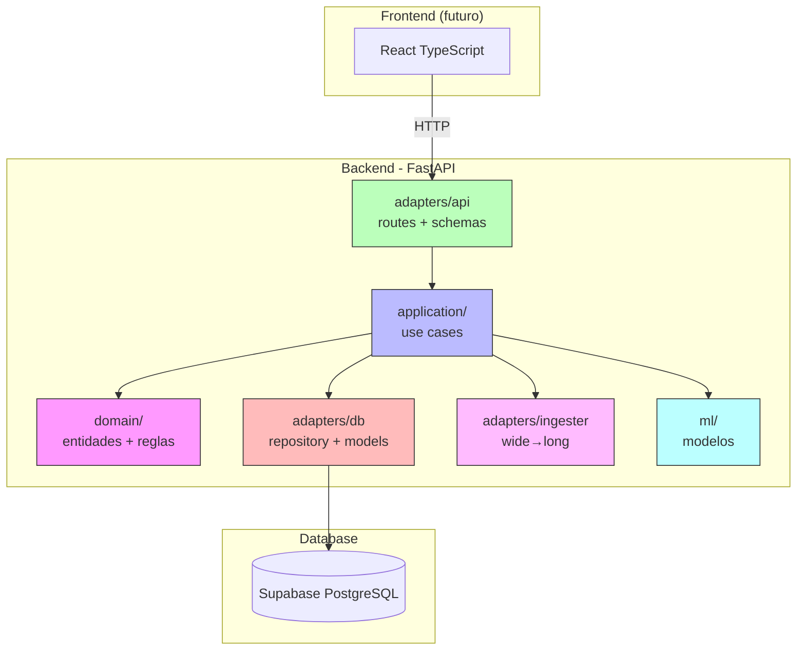
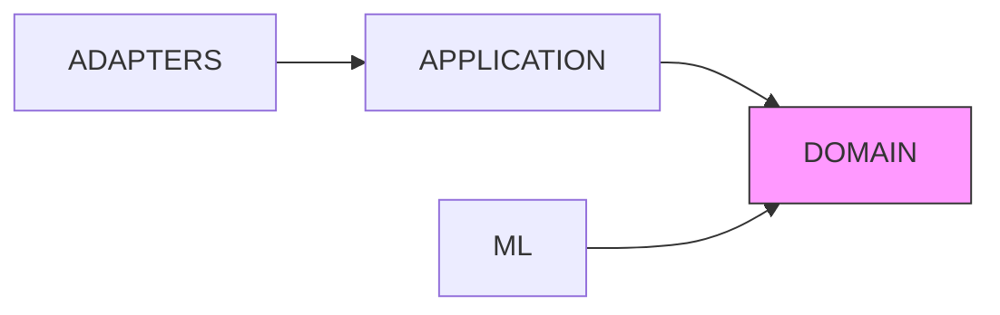

# Arquitectura del Sistema

> [!abstract] Visión general
> Monolito modular (ADR-003) con separación por capas:
> `domain/` → `application/` → `adapters/`

---

## Diagrama de Arquitectura



---

## Regla de Dependencia

> [!important] ADR-003
> La dependencia va hacia adentro:
> - `adapters/` puede importar `application/` y `domain/`
> - `application/` puede importar `domain/`
> - `domain/` NO importa nada externo
> - `ml/` solo importa `domain/`



---

## Capas

| Capa | Directorio | Responsabilidad |
|---|---|---|
| **Dominio** | `domain/` | Entidades, reglas, invariantes, errores |
| **Aplicación** | `application/` | Casos de uso (orquestación) |
| **Adapters API** | `adapters/api/` | FastAPI routes, schemas, error mapping |
| **Adapters DB** | `adapters/db/` | SQLAlchemy models, repositories, session |
| **Adapters Ingesta** | `adapters/ingester/` | Transformación wide→long |
| **ML** | `ml/` | Modelos, entrenamiento, inferencia |

---

## ADRs

| ADR | Decisión | Estado |
|---|---|---|
| [[ADR-001 - Stack]] | FastAPI + React TS | ✅ Aceptado |
| [[ADR-002 - Database]] | Supabase PostgreSQL | ✅ Aceptado |
| [[ADR-003 - Arquitectura]] | Monolito modular | ✅ Aceptado |
| [[ADR-004 - Ingesta de Datos]] | wide→long en ingesta | ✅ Aceptado |

---

## Estructura de Archivos

```
agrosense-v2/
├── backend/
│   ├── src/agrosense/
│   │   ├── domain/
│   │   │   ├── entities.py
│   │   │   ├── errors.py
│   │   │   └── rules.py
│   │   ├── application/
│   │   │   └── use_cases/
│   │   │       ├── create_project.py
│   │   │       └── upload_campaign.py
│   │   ├── adapters/
│   │   │   ├── api/
│   │   │   │   ├── app.py
│   │   │   │   ├── deps.py
│   │   │   │   ├── errors.py
│   │   │   │   ├── schemas.py
│   │   │   │   └── routes/
│   │   │   │       └── projects.py
│   │   │   ├── db/
│   │   │   │   ├── models.py
│   │   │   │   ├── session.py
│   │   │   │   └── repository.py
│   │   │   └── ingester/
│   │   │       ├── column_mapping.py
│   │   │       ├── wide_to_long.py
│   │   │       ├── ingest.py
│   │   │       └── cli.py
│   │   └── ml/  (futuro)
│   ├── tests/
│   ├── alembic/
│   └── pyproject.toml
├── docs/
│   ├── 01-discovery.md
│   ├── 02-domain.md
│   ├── 03-architecture.md
│   └── adr/
└── frontend/ (futuro)
```

---

## Seguridad

> [!warning] Reglas de seguridad
> - Secrets nunca en source control
> - `.env` gitignored
> - Autenticación y autorización explícitas
> - Input del usuario no es confiable
> - Uploads validados
> - Errores externos sanitizados

---

## Links

- [[ADR-001 - Stack]]
- [[ADR-002 - Database]]
- [[ADR-003 - Arquitectura]]
- [[ADR-004 - Ingesta de Datos]]
- [[Modelo de Dominio]]
- [[Setup Técnico]]
