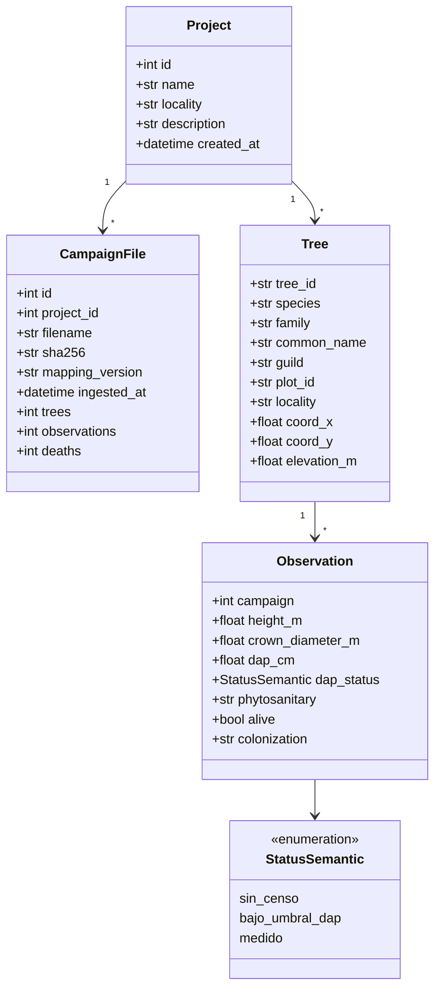

# Modelo de Dominio

> [!abstract] Entidades y reglas de negocio
> Todo el dominio vive en `domain/` y NO depende de infraestructura.

---

## Entidades Principales



---

## StatusSemantic

> [!important] Valor object
> `StatusSemantic` clasifica el estado del DAP (diámetro a la altura del pecho):

| Valor | Significado | Cuándo ocurre |
|---|---|---|
| `sin_censo` | No hay medición en esta campaña | Árbol nuevo o ausente |
| `bajo_umbral_dap` | DAP = 0.0 (menor al umbral) | Joven, no alcanza 1.3m |
| `medido` | DAP > 0.0 | Medición válida |

> [!note] Regla de negocio
> DAP = 0.0 en 714/717 casos M1 = **marker** (no es medición real).
> Solo ~3 árboles tienen DAP = 0.0 por estar bajo umbral.

---

## Errores de Dominio

> Ver [[#Reglas de Dominio|Reglas de Dominio]] más abajo para el detalle de invariantes

### Errores — rechazan la campaña ENTERA (→ HTTP 422)

| Error | Código | Significado |
|---|---|---|
| `DeathViolationError` | `DEATH_VIOLATION` | Árbol muerto revive o crece |
| `SpeciesMismatchError` | `SPECIES_MISMATCH` | Cambia de especie entre campañas o entre cargas |
| `TreeIdentityMismatchError` | `TREE_IDENTITY_MISMATCH` | Cambia parcela o coordenadas respecto a lo cargado |
| `NegativeMeasurementError` | `NEGATIVE_MEASUREMENT` | Altura o copa < 0 |
| `NonContiguousCensusError` | `NON_CONTIGUOUS_CENSUS` | Censo con huecos desde el primer censo |

### Warnings — la ingesta CONTINÚA y se reportan en la respuesta

| Warning | `type` en el contrato | Significado |
|---|---|---|
| `SuspiciousContractionWarning` | `contraction` | Altura "encoge" >1 cm (error de medición) |
| `SuspiciousRevivalWarning` | `revival` | Muerto→vivo: replanteo o ID reusado |
| `CensusGapWarning` | `census_gap` | Censado, saltó campañas y reapareció |

> [!warning] Corrección respecto a notas anteriores
> `CensusGap` NO impide la ingesta: es un **warning** (1/856 casos en el
> dataset real). Y la altura no "solo aumenta": se tolera una contracción de
> hasta **1 cm** como error de medición documentado (~13/652 casos).

---

## Reglas de Dominio

### Temporales

> [!important] Invariantes
> 1. **Muerte congelada**: si `alive=False`, no revive ni crece
> 2. **Contracción acotada**: puede encoger ≤1 cm (medición); más es warning
> 3. **Censo contiguo** desde el primer censo; los huecos son warning
> 4. **Identidad persistente**: un `tree_id` no cambia de especie, parcela ni
>    coordenadas — ni entre campañas ni entre archivos

---

## Re-subida de una campaña

> [!important] Decisión de producto del 2026-09-20
> El dataset crudo es inmutable; los errores se corrigen re-subiendo.

| Caso | Resultado |
|---|---|
| Mismo SHA-256 | `409 DUPLICATE_FILE`, no se crea campaña |
| SHA-256 distinto | Campaña **nueva**; la anterior intacta |
| Valores de observación | Se corrigen: manda el archivo más reciente |
| Descriptivos (familia, nombre común, gremio, localidad, elevación) | Se corrigen |
| Identidad (especie, parcela, coords) | **Rechaza la carga** → 422 |
| Filas ausentes en el archivo nuevo | No se borran (deuda #I) |

La regla vive en `domain/rules.validate_tree_identity`, no en el repositorio:
recibe la fila persistida por duck-typing, así que el dominio sigue sin
conocer la persistencia.

### Validación

```python
# domain/rules.py
validate_tree_observations(tree)      # invariantes temporales de la serie
growth_between(obs_prev, obs_next)    # crecimiento entre campañas censadas
validate_tree_identity(stored, tree)  # identidad estable entre cargas
```

---

## Reglas de Negocio

### DAP = 0.0

```
Si DAP == 0.0:
  → Marcar como "bajo_umbral_dap"
  → NO es medición real
  → No contar para métricas de crecimiento
```

### Replantación

```
Si alive pasa de False → True:
  → Es sospechoso (¿replantación?)
  → Registrar warning
  → Verificar si hay evidencia de replanteo
```

### Census Gap

```
Si hay salto de campañas (M1 → M4):
  → Registrar warning
  → No hay datos intermedios
  → Crecimiento acumulado puede ser engañoso
```

---

## Archivos del Dominio

| Archivo | Contenido |
|---|---|
| `domain/entities.py` | Observation, Tree, StatusSemantic |
| `domain/errors.py` | DeathViolation, CensusGap, SuspiciousRevival |
| `domain/rules.py` | validate_tree_observations, growth_between, validate_tree_identity |

---

## Links

- [[Sistema]] — Arquitectura
- [[ADR-004 - Ingesta de Datos]] — wide→long
- [[Slice 1 - Fundación de Datos]] — Implementación
- [[Resumen ML]] — Señales del dominio
