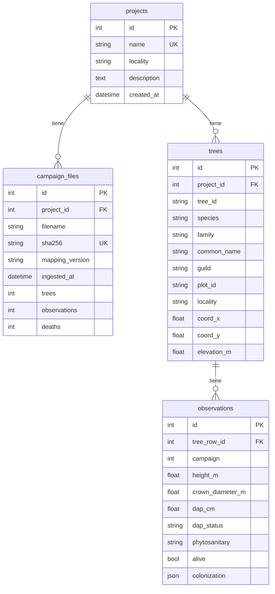
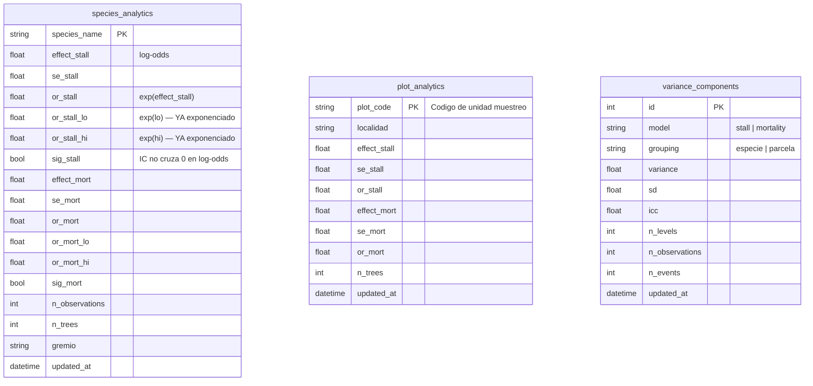

# Base de Datos

> [!abstract] Schema de PostgreSQL y queries útiles
> Supabase PostgreSQL sa-east-1

---

## Tablas



---

## Tablas analíticas (slice 5, migración `b1c4a7f20e51`)

> [!note] No cuelgan del grafo de proyectos — es deliberado
> Son un **caché de lectura** de una estimación offline: los efectos de los
> modelos mixtos (`lme4::glmer`) sobre el dataset completo del programa, no
> sobre un proyecto concreto. Por eso no tienen `project_id` ni FK hacia
> `projects`, y hay un test que lo verifica. Cuando exista multi-proyecto real,
> eso pide un ADR, no una columna.



| Tabla | Filas | Origen |
|---|---|---|
| `species_analytics` | 30 | `efectos_aleatorios*.csv`, `grupo == "especie"` |
| `plot_analytics` | 45 | `efectos_aleatorios*.csv`, `grupo == "parcela"` |
| `variance_components` | 4 | `componentes_varianza*.csv` |

> [!warning] Columnas nullable, y por qué
> El panel de mortalidad cubre **45** parcelas y el de estancamiento **42**.
> Las 3 que solo existen en mortalidad entran con `effect_stall` en NULL — no
> se descartan ni se rellenan con cero. Todos los merges del loader son OUTER.

> [!danger] `effect_*` está en log-odds; `or_*` en odds ratio
> `or = exp(effect)`, `or_lo = exp(efecto − 1.96·se)`, `or_hi = exp(efecto +
> 1.96·se)`. Los `or_*_lo/hi` se guardan **ya exponenciados**. La UI solo
> muestra OR; el log-odds viaja aparte y etiquetado (`ci95_log_odds`) para
> poder cotejar contra el CSV.

Se cargan con un script, nunca desde un endpoint:

```bash
cd backend
alembic upgrade head
python scripts/load_analytics.py --dry-run   # valida sin escribir
python scripts/load_analytics.py
```

---

## Constraints

| Tabla | Constraint | Tipo |
|---|---|---|
| projects | `name` UNIQUE | Unique |
| campaign_files | `(project_id, sha256)` | Unique |
| trees | `(project_id, tree_id)` | Unique |
| observations | `(tree_row_id, campaign)` | Unique |
| campaign_files | `project_id` FK → projects | CASCADE |
| trees | `project_id` FK → projects | CASCADE |
| observations | `tree_row_id` FK → trees | CASCADE |
| species_analytics | `species_name` PK | Primary key |
| plot_analytics | `plot_code` PK | Primary key |
| variance_components | `(model, grouping)` | Unique |

Índices intencionales de las tablas analíticas: `or_stall`, `or_mort` y
`gremio` en `species_analytics` (los dos rankings ordenan por OR y el único
facet del dashboard es el gremio) y `localidad` en `plot_analytics`.

---

## Queries Útiles

### Contenido de la DB

```sql
-- Contar proyectos
SELECT count(*) FROM projects;

-- Contar árboles por proyecto
SELECT p.name, count(t.id) as trees
FROM projects p
JOIN trees t ON t.project_id = p.id
GROUP BY p.name;

-- Contar observaciones por proyecto
SELECT p.name, count(o.id) as observations
FROM projects p
JOIN trees t ON t.project_id = p.id
JOIN observations o ON o.tree_row_id = t.id
GROUP BY p.name;
```

### Diagnóstico

```sql
-- Sesiones activas
SELECT pid, state, query
FROM pg_stat_activity
WHERE datname = current_database();

-- Locks
SELECT * FROM pg_locks WHERE NOT granted;

-- Proyectos con datos
SELECT p.id, p.name,
       (SELECT count(*) FROM trees t WHERE t.project_id = p.id),
       (SELECT count(*) FROM observations o
        JOIN trees t ON o.tree_row_id = t.id
        WHERE t.project_id = p.id)
FROM projects p;
```

### Limpieza

```sql
-- Borrar proyecto y sus datos (CASCADE)
DELETE FROM projects WHERE id = 16;

-- Borrar todos los datos (cuidado)
TRUNCATE observations, trees, campaign_files, projects CASCADE;
```

---

## Conexión

```python
import os
from dotenv import load_dotenv
import psycopg2

load_dotenv()
conn = psycopg2.connect(os.environ["DATABASE_URL"])
conn.autocommit = True

with conn.cursor() as cur:
    cur.execute("SELECT count(*) FROM projects")
    print(cur.fetchone()[0])

conn.close()
```

---

## Migraciones

```bash
# Crear migración
alembic revision --autogenerate -m "descripcion"

# Aplicar
alembic upgrade head

# Rollback
alembic downgrade -1
```

---

## Links

- [[ADR-002 - Database]] — Decisión
- [[Setup Técnico]] — Configuración
- [[Sistema]] — Arquitectura
