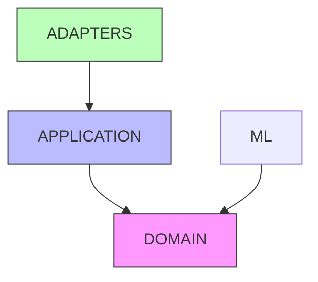

# ADR-003: Arquitectura

> [!abstract] Monolito modular
> **Estado**: ✅ Aceptado

---

## Contexto

Necesitamos una arquitectura que escale con el proyecto pero que
no sea overly engineered para una startup/studio pequeña.

## Decisión

**Monolito modular** con separación por capas:
`domain/` → `application/` → `adapters/`

## Alternativas Consideradas

| Opción | Pros | Contras | Veredicto |
|---|---|---|---|
| **Monolito modular** | Simple, deployable, testeable | Acoplamiento si no se cuida | ✅ Elegido |
| Microservicios | Escalabilidad independiente | Complejidad operacional excesiva | Rechazado |
| Serverless | Sin servidores | Cold starts, debugging difícil | Rechazado |

## Reglas

1. **Dependencia hacia adentro**: adapters → application → domain
2. **Domain puro**: sin dependencias de infraestructura
3. **Adapters**: implementaciones concretas (DB, API, ML)
4. **Application**: orquestación, sin lógica de negocio

## Consecuencias

- Deploy simple (un solo container)
- Tests rápidos (SQLite para integración)
- Fácil de entender para el equipo
- Evolución a microservicios si es necesario (ADR futuro)

---

## Diagrama

---

## Links

- [[Sistema]] — Arquitectura completa
- [[Modelo de Dominio]] — Domain layer
